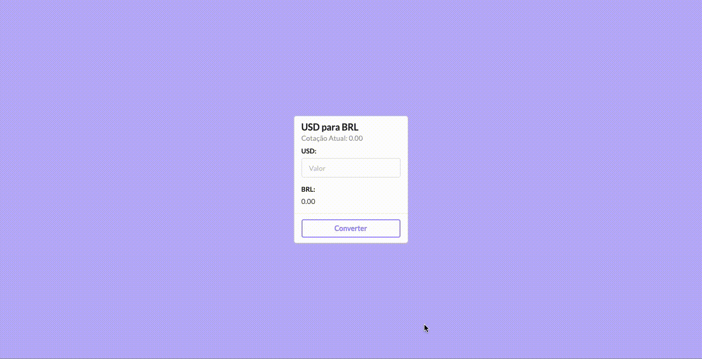

# Conversor de moeda USD para BRL - REACT JS

##### [Live Demo](https://ecstatic-kilby-3111f2.netlify.app) :point_left:

 

  

 

### API

https://free.currencyconverterapi.com/

### Run the Project

+ Clone this repo `https://github.com/fernandocarelle/conversorReact-USD-BRL.git`
+ `cd conversor-moeda`
+ run `npm install`
+ Get your API key from https://free.currencyconverterapi.com/
+ run `npm start`

This project was bootstrapped with [Create React App](https://github.com/facebook/create-react-app)